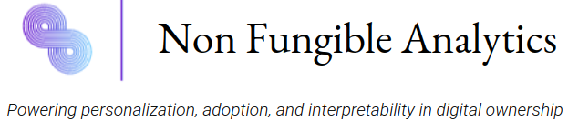

# Non-Fungible Analytics (MIT Bitcoin Hackathon 2022)
We present a stacks-based recommender sytem for NFTs that is powered by AI, with security measures to protect against washing.

Use cases include:
-NFT collection analysis on price anomalies and multiple-wallet-ownership
-Warning system integrated on top of recommendations and custom searches
-Protecting the users by reducing scams, fraud and financial loss

We fetched all NFT data from the Stacks Blockchain with python deployed APIs (e.g. collection name, prices, volume, description, attributes, images). After cleaning and processing this data, we ran Neural Networks and Principle Component Models to create NFT embeddings. Multidimensional mappings with many valuable use cases. 

## infrastructure 

Using the Stacksdata open API, the python request module is used to query a list of all NFT contracts. 

For each contract, the name, description, token ID and url of constituent NFTs are accumulated into a database. In total, the Stacksdata API queries ‘token’ , ‘transactions’ , and ‘volumes’ are called, and the responses are processed at the NFT level and tabularized.

etl.py provides the 'production' implementation that generated data for ingestion by the AI embedding process. Experimental versions, and the wash trade analytics, are stored in the *hackexpo* directory. 

## AI

State of the art neural networks for natural language processing and computer vision are used for embedding NFT text data and image data. The high dimensional representation of each NFT can be used for myriad use cases including NFT recommendation and targeted airdrops. The HTML files in the embedding directory contains preliminary work which can be loaded in a browser.  

embedding.py contains a text-only machine learning model using the pretrained sentence transformer, which yields representations with informative structure for our scoped uses. 

NFT_Neural_Network_Embedding.ipynb contains an image-based ML model that encodes url-retrieved images and creates an embedding on visual signals.

## embedding

A directory of NFT-level embeddings visualized with t-stochastic neighbor embedding (t-SNE) and Principal Component Analysis (PCA). The html files may be loaded in a browser tab.  

## smart-contract

We decided to implement a cool feature, enabled by our NFT embeddings: A targeted airdrop. Airdrops are a fun way to add additional value to your brand or experience, but creators currently have to expend a lot of effort to find communities that support their mission. 
We optimize airdrops by allowing creators to connect with communities that are aligned with their mission.

Suppose we want to launch an airdrop for the bitcoin expo. Our webapp, built with django and bootstrap, would allow users to seamlessly upload data describing their NFT.
Once they decide to launch, we map this data to an embedding in our latent space and find users which hold similar NFTs. 
This process completely reduces the manual effort of finding the right communities, 
In doing so we Increases the amount of engagement and awareness for the project
